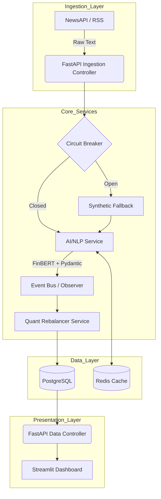
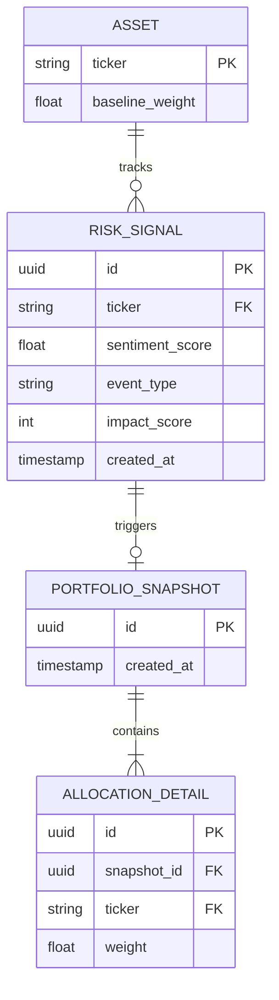

# RFC-001: Autonomous AI/NLP Risk Engine & Tactical Index Rebalancing Platform
**Target:** S&P Global & CRISIL Campus Hackathon 2026 — Phase 3 Case Study
**Architecture Pattern:** Layered MVC (Controller-Service-Repository)

## 1. Deconstruct and Define Requirements

*   **Functional Requirements:** The system must asynchronously ingest unstructured financial news and social media feeds, process them through an autonomous AI/NLP pipeline to extract deterministic risk signals (Sentiment [-1.0 to 1.0], Event Type, and Impact [1-10]), and immediately route these signals to Module A. Module A will dynamically rebalance a 10-stock S&P 100 portfolio using a sentiment-tilted optimization model.
*   **Non-Functional Requirements:** 
    *   **Latency:** Sub-150ms for localized NLP inference; sub-500ms total pipeline latency from ingestion to database commit.
    *   **Scale:** Support up to 100 QPS of concurrent ingestion traffic.
    *   **Security & Integrity:** All data must be ACID compliant, utilizing PostgreSQL for transactional safety. Strict Pydantic schemas must validate all API inputs to prevent injection attacks.
*   **Edge Cases:**
    *   **Network Drops:** External feed failures must trigger Circuit Breakers, falling back to local synthetic data without crashing the pipeline.
    *   **Conflicting Data:** High-frequency contradicting sentiment on a single asset will be smoothed using an exponential time-decay moving average.

## 2. High-Level Design (HLD) & Architecture

*   **Data Flow:** Ingestion Layer -> Message Buffer -> AI/NLP Service -> Signal Event Bus -> Quant Rebalancer Service -> Repository -> API Controllers -> UI.
*   **Core Stack:** Python 3.11 with FastAPI for the backend to ensure zero-IPC overhead with PyTorch/FinBERT. Streamlit for the high-responsiveness frontend dashboard.
*   **Data Integrity:** PostgreSQL serves as the primary datastore to guarantee transactional integrity during concurrent portfolio rebalancing events.
*   **Performance:** Redis is utilized as an in-memory semantic cache to deduplicate identical headlines and serve recent risk signals in sub-10ms.

## 3. Low-Level Design (LLD) & API Contracts

### Application Architecture (SOLID & MVC)
The codebase must strictly adhere to a layered architectural pattern:
1.  **Controllers (`src/api/controllers/`):** Handle HTTP routing and request validation.
2.  **Services (`src/core/services/`):** Contain all business logic (NLP orchestration, quantitative math).
3.  **Repositories (`src/db/repositories/`):** Handle all SQLAlchemy/SQL database interactions.
*   **Dependency Injection:** Enforce Dependency Injection globally using FastAPI's `Depends()`. Services and Repositories must be injected into Controllers to ensure full testability.

### Exact Design Patterns Required
*   **Strategy Pattern:** Implement `IRebalanceStrategy` interface for swapping quantitative formulas (`EqualWeightStrategy` vs `SentimentTiltedStrategy`).
*   **Observer Pattern:** Implement an event bus where the `NLPService` publishes signals, and the `RebalancerService` and `AuditLogger` subscribe as independent listeners.
*   **Circuit Breaker Pattern:** Protect external HTTP API calls with a State Machine (CLOSED, OPEN, HALF-OPEN).
*   **Factory Method:** Implement `NLPModelFactory` to dynamically instantiate local HuggingFace pipelines versus external LLM clients.

### Database Internals (PostgreSQL)

*   **Connection Pooling:** Utilize SQLAlchemy's `QueuePool` with a pool size of 20 and max overflow of 10 to handle high-frequency concurrent writes.
*   **Indexing Strategy:** Composite B-Tree indexes on `(ticker, created_at)` for the `RISK_SIGNAL` table to optimize time-series queries.
*   **Partitioning:** Implement declarative table partitioning by month for the `ALLOCATION_DETAIL` table to ensure fast aggregations as historical data scales.

### Critical API Contracts
**1. POST /api/v1/signals/ingest**
*   **Payload:** `{"ticker": "AAPL", "text": "Factory shutdown halts production.", "source": "NewsAPI"}`
*   **Response (201):** `{"signal_id": "uuid", "sentiment": -0.85, "impact": 9, "status": "processed"}`

**2. POST /api/v1/portfolio/rebalance**
*   **Payload:** `{"strategy": "SentimentTilted", "decay_lambda": 0.85}`
*   **Response (200):** `{"snapshot_id": "uuid", "weights": [{"ticker": "AAPL", "weight": 0.04}], "sum": 1.0}`

### Quantitative Rebalancing Formulation (Module A)
Given an index basket of N stocks, where the initial baseline weight is 1/N:

1. **Signal Aggregation with Time-Decay:**  
   For each stock over a historical observation window, the aggregated sentiment (S_avg) is calculated by multiplying the Raw Sentiment by (Impact Score / 10), and applying an exponential decay factor (Lambda) based on the age of the signal.
2. **Sentiment Tilt Formulation:**  
   The new unnormalized target weight is calculated as:
   Target_Weight = Baseline_Weight * (1 + (Alpha * S_avg))
   Where Alpha (e.g., 0.2 to 0.4) governs the sensitivity of the portfolio to news events.
3. **Box-Constrained Normalization:**  
   The portfolio is strictly normalized so that the sum of all weights equals exactly 1.0 (100%). During normalization, iterative clipping is applied to ensure no single stock drops below 0.02 (2%) or exceeds 0.25 (25%).

## 4. System Resilience & The Innovation Factor (AI)

*   **Fault Tolerance:** The Circuit Breaker pattern wraps all outbound `httpx` client calls. If NewsAPI drops, the system falls back to a Redis-cached state or localized CSV synthetic data, maintaining 100% uptime.
*   **Agentic AI Workflow:** An autonomous LLM orchestration pipeline handles classification. The agent ingests unstructured text, validates it against a strict Pydantic JSON schema, and dynamically assigns the 5 specific Hackathon event classes without human intervention. 
*   **Chaos Engineering:** Implement an asynchronous reverse-proxy fault-injection testing engine to evaluate the resilience of the AI agent tool calls. Prior to deployment, this engine simulates catastrophic conditions by injecting HTTP 429 rate limits, 500ms network jitter, and malformed LLM JSON responses into the pipeline to verify the robustness of fallback mechanisms.

## 5. Architectural Trade-offs

1.  **FastAPI/Python over Node.js/Wasm:** Running local PyTorch (`ProsusDE/finbert`) requires native Python execution. Using Node.js would force high-latency Inter-Process Communication (IPC). Python 3.11 with FastAPI provides the necessary concurrency while natively supporting enterprise AI tooling.
2.  **Iterative Clipping over Quadratic Solvers:** Financial solvers require heavy external C-libraries which increase container bloat and deployment complexity. Iterative simplex clipping guarantees O(N) execution speed, adhering to the ultra-low latency requirement.
3.  **Streamlit over Next.js:** Within a 6-day sprint, Streamlit eliminates API serialization impedance, allowing engineering hours to be completely allocated to ACID compliance, NLP accuracy, and quant logic.
